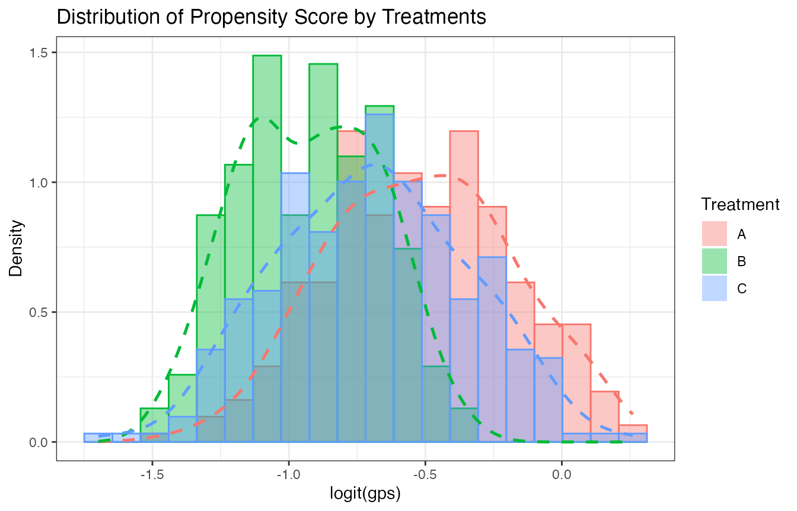
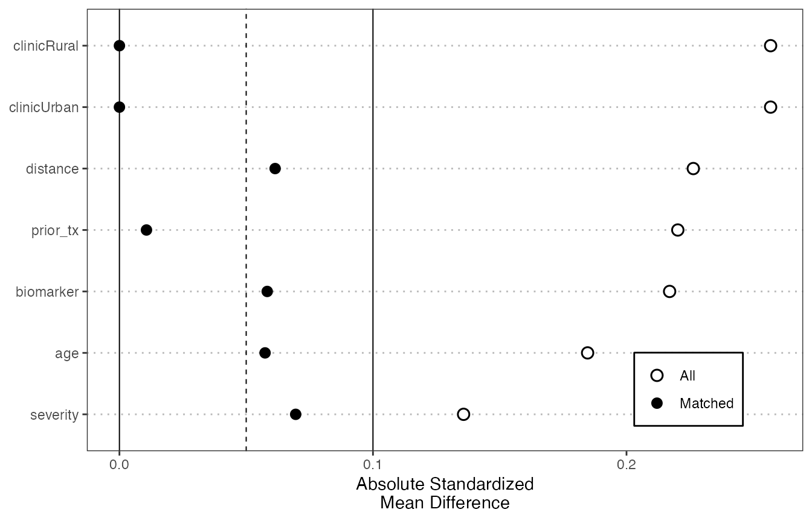

# Minimal BC-GPSM Workflow

This article shows a minimal end-to-end workflow for `BC.GPSM`
(`BC-GPSM`). The example uses simulated data with three treatment
groups, six baseline covariates, and a continuous outcome.

``` r

library(BC.GPSM)
```

## Simulate Example Data

``` r

set.seed(123)
n <- 300
z1 <- rnorm(n)
z2 <- rnorm(n)
age <- 50 + 8 * z1
biomarker <- 0.6 * z2 + rnorm(n, sd = 0.5)
severity <- 0.35 * z1 - 0.25 * z2 + rnorm(n, sd = 0.9)
distance <- runif(n, -1, 1)
prior_tx <- rbinom(n, 1, plogis(0.1 * z1 - 0.1 * z2))
clinic <- factor(rbinom(n, 1, 0.45), labels = c("Rural", "Urban"))

score <- cbind(
  A = 0,
  B = 0.35 * (0.05 * (age - 50) - 0.20 * biomarker +
    0.18 * severity + 0.20 * prior_tx),
  C = 0.35 * (-0.02 * (age - 50) + 0.25 * biomarker -
    0.18 * distance + 0.18 * (clinic == "Urban"))
)
prob <- exp(score) / rowSums(exp(score))
trt <- apply(prob, 1, function(p) sample(c("A", "B", "C"), 1, prob = p))

dat <- data.frame(
  trt = factor(trt, levels = c("A", "B", "C")),
  age = age,
  biomarker = biomarker,
  severity = severity,
  distance = distance,
  prior_tx = prior_tx,
  clinic = clinic
)
dat$y <- 1 + 0.5 * (dat$trt == "B") + 1.0 * (dat$trt == "C") +
  0.03 * age - 0.4 * biomarker + 0.25 * severity - 0.2 * distance +
  0.3 * prior_tx + 0.2 * (clinic == "Urban") + rnorm(n)

head(dat)
#>   trt      age   biomarker    severity   distance prior_tx clinic        y
#> 1   C 45.51619  0.10786082 -0.93005868  0.4646435        1  Rural 2.007534
#> 2   C 48.15858 -0.46528686 -0.60457237  0.2194214        0  Urban 2.981276
#> 3   B 62.46967 -0.57978839  1.04981690 -0.5512557        1  Rural 4.221387
#> 4   A 50.56407 -1.38954178  1.76295297  0.8323420        0  Urban 4.803756
#> 5   C 51.03430  0.13289695  1.13069590  0.6055220        1  Rural 5.526894
#> 6   A 63.72052  0.09334041 -0.04463277 -0.3751828        0  Urban 3.457639
```

## Fit the Main Estimator

Use
[`dr_gpsm()`](https://leo-liuqiang.github.io/BC-GPSM/reference/dr_gpsm.md)
for the cross-fitted estimator. In this example, treatment `A` is used
as the reference group, so contrast labels such as `BvA` mean the
estimated mean potential outcome under `B` minus the estimated mean
potential outcome under `A`.

``` r

fit <- dr_gpsm(
  data = dat,
  treatment = 1,
  treatment_ref = "A",
  covariate = 2:7,
  outcome = 8,
  gps_model = "logit",
  outcome_model = "lm",
  folds = 2,
  nboot = 50
)

data.frame(
  contrast = names(fit$estimate),
  estimate = fit$estimate,
  ci_lower = fit$ci_lower,
  ci_upper = fit$ci_upper,
  row.names = NULL
)
#>   contrast  estimate   ci_lower ci_upper
#> 1      BvA 0.3841538 0.09204874 0.560658
#> 2      CvA 1.0971292 0.85642357 1.374370
#> 3      CvB 0.7129754 0.42319271 1.012751
```

For final analyses, use a larger `nboot` such as `500` or more. The
smaller value above keeps the example quick to run.

## Inspect GPS Overlap

[`gps_pre_process()`](https://leo-liuqiang.github.io/BC-GPSM/reference/gps_pre_process.md)
can fit a full-sample diagnostic GPS model and add `gps_` and `loggps_`
columns. These diagnostic scores are useful for visualizing overlap;
[`dr_gpsm()`](https://leo-liuqiang.github.io/BC-GPSM/reference/dr_gpsm.md)
itself uses cross-fitted GPS values internally.

``` r

gps_dat <- gps_pre_process(
  data = dat,
  treatment = 1,
  treatment_ref = "A",
  covariate = 2:7,
  gps_model = "logit"
)

gps_histogram(gps_dat, bins = 20)
```



## Check Covariate Balance

Use
[`balance_check_plot()`](https://leo-liuqiang.github.io/BC-GPSM/reference/balance_check_plot.md)
to compare pairwise covariate balance before and after nearest-neighbor
matching. The plot reports absolute standardized mean differences;
smaller values indicate better balance. The example standardizes
covariates before matching so that variables on different scales
contribute comparably to the matching distance.

``` r

balance_check_plot(
  data = dat,
  treatment = 1,
  treatment_ref = "A",
  covariate = 2:7,
  match_on = "covariates",
  standardize = TRUE,
  style = "love"
)
```



The same function can also use existing `loggps_*` columns. For example,
after creating `gps_dat` above:

``` r

balance_check_plot(
  data = gps_dat,
  treatment = 1,
  treatment_ref = "A",
  covariate = 2:7,
  match_on = "gps",
  fit_gps = FALSE
)
```

## Choosing Options

Start with transparent models:

- `gps_model = "logit"` for multinomial logistic GPS estimation;
- `outcome_model = "lm"` for a simple outcome-regression adjustment;
- `treatment_ref` set explicitly when a natural control group exists.

Then compare sensitivity to more flexible nuisance models such as `gbm`,
`rf`, or `gam` when the sample size is large enough to support them.

## Optional Learners and Tuning

The baseline `logit + lm` workflow does not require the optional
modeling stack. Install only the packages needed by the selected model
or tuning path:

``` r

install.packages(c(
  "gbm", "mgcv", "VGAM", "randomForest", "glmnet",
  "caret", "ModelMetrics", "pROC", "foreach"
))
```

`xgboost` and `ranger` provide additional GPS and outcome-model
backends:

``` r

install.packages(c("xgboost", "ranger"))
```

These two backends are experimental and remain under active testing. For
now, use them as sensitivity analyses and report their package versions
and model settings whenever results are shared.
